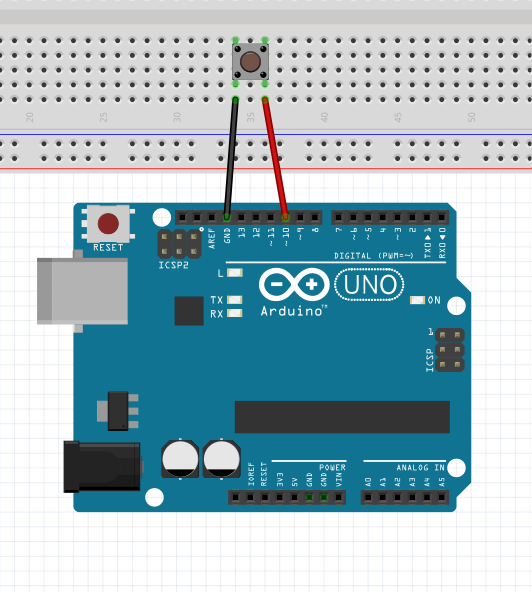

Button
-----------------

The connection diagram for button is shown below:

+----------+--------------+
| LED      | Arduino Uno  |
+==========+==============+
| VCC      | D10          |
+----------+--------------+
| GND      | GND          |
+----------+--------------+

Reading Button State
^^^^^^^^^^^^^^^^^^^^^^^^^^

.. code-block:: python

   import raspidevkit
   import time

   machine = raspidevkit.Machine()
   arduino = machine.attach_arduino('/dev/ttyUSB0')
   button = arduino.attach_led(10)
   pressed = button.read()
   print(pressed)
