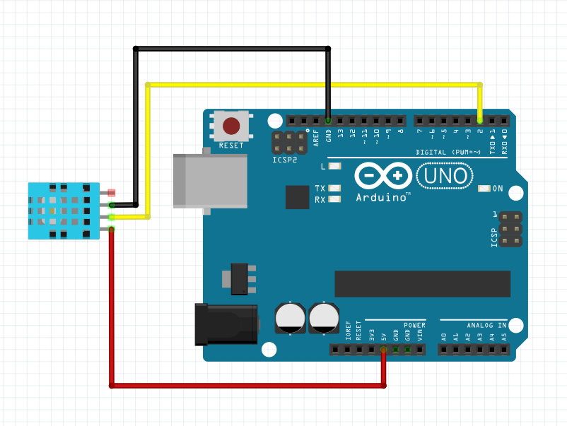

DHT Sensor
-----------------

DHT11 and DHT22 sensors have the same utility and just their working conditions differ and the way they are initialized
The connection diagram for DHT sensor is shown below:

+------------+--------------+
| DHT Sensor | Arduino      |
+============+==============+
| VCC        | 5V           |
+------------+--------------+
| GND        | GND          |
+------------+--------------+
| Data       | D2           |
+------------+--------------+

Initializing DHT11
^^^^^^^^^^^^^^^^^^^^^^^

.. code-block:: python

   import raspidevkit
   machine = raspidevkit.Machine()
   arduino = machine.attach_arduino('/dev/ttyUSB0')
   dht11 = arduino.attach_dht11(2)

Initializing DHT22
^^^^^^^^^^^^^^^^^^^^^^^

.. code-block:: python

   import raspidevkit
   machine = raspidevkit.Machine()
   arduino = machine.attach_arduino('/dev/ttyUSB0')
   dht22 = arduino.attach_dht22(2)

Reading Temperature
^^^^^^^^^^^^^^^^^^^^^^^

.. code-block:: python

   import raspidevkit
   machine = raspidevkit.Machine()
   arduino = machine.attach_arduino('/dev/ttyUSB0')
   dht11 = arduino.attach_dht11(2)
   temperature = dht11.get_temperature()
   print(temperature)

Reading Humidity
^^^^^^^^^^^^^^^^^^^^^^^

.. code-block:: python

   import raspidevkit
   machine = raspidevkit.Machine()
   arduino = machine.attach_arduino('/dev/ttyUSB0')
   dht11 = arduino.attach_dht11(2)
   humidity = dht11.get_humidity()
   print(humidity)

Get All Parameters
^^^^^^^^^^^^^^^^^^^^^^^

It is inefficient to call each get parameter per read.
If you want to get both parameter in both reading use ``get_data()``

.. code-block:: python
    
   import raspidevkit
   machine = raspidevkit.Machine()
   arduino = machine.attach_arduino('/dev/ttyUSB0')
   dht11 = arduino.attach_dht11(2)
   temperature, humidity = dht11.get_data()
   print(temperature)
   print(humidity)
