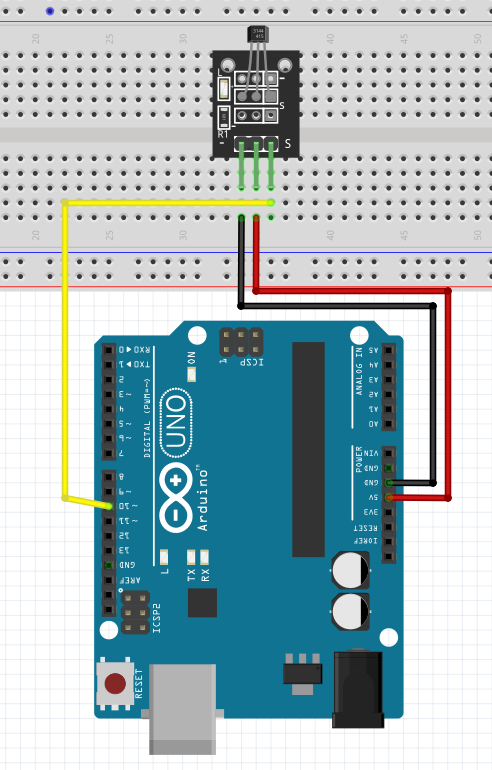

Hall Effect Sensor
------------------------

The connection diagram for hall effect sensor is shown below:

+----------+--------------+
| LED      | Arduino Uno  |
+==========+==============+
| Signal   | D10          |
+----------+--------------+
| VCC      | 5V           |
+----------+--------------+
| GND      | GND          |
+----------+--------------+

Depending on the model of the hall effect sensor, you might need to add capacitors
and resistors to make it make. In this sketch, the model used is KY-003.

Reading Sensor State
^^^^^^^^^^^^^^^^^^^^^^^^^^

.. code-block:: python

   import raspidevkit
   import time

   machine = raspidevkit.Machine()
   arduino = machine.attach_arduino('/dev/ttyUSB0')
   hall_effect_sensor = arduino.hall_effect_sensor(10)
   value = hall_effect_sensor.read()
   print(value)
