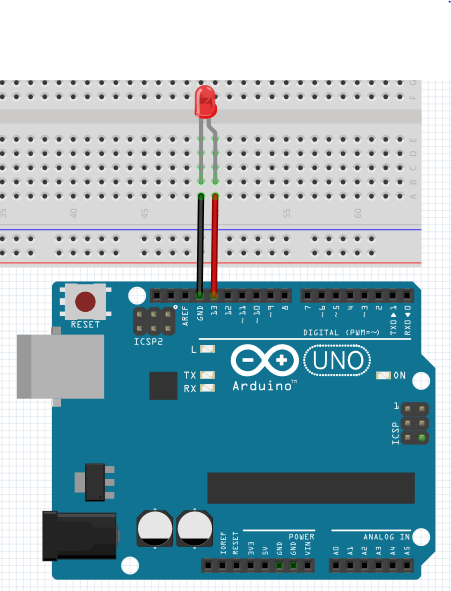

LED
-----------------

The connection diagram for LED is shown below:

+----------+--------------+
| LED      | Arduino Uno  |
+==========+==============+
| VCC      | D13          |
+----------+--------------+
| GND      | GND          |
+----------+--------------+

Blinking LED
^^^^^^^^^^^^^^^^^

.. code-block:: python

   import raspidevkit
   import time

   machine = raspidevkit.Machine()
   arduino = machine.attach_arduino('/dev/ttyUSB0')
   led = arduino.attach_led(13)
   led.turn_on()
   time.sleep(3)
   led.turn_off()
