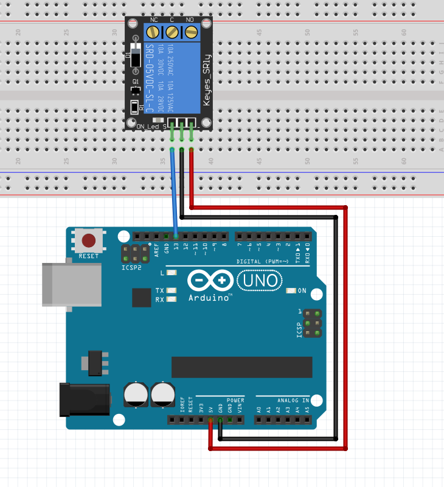

Relay
-----------------

The connection diagram for relay is shown below:

+----------+--------------+
| Relay    | Arduino Uno  |
+==========+==============+
| VCC      | D13          |
+----------+--------------+
| VCC      | 5V           |
+----------+--------------+
| GND      | GND          |
+----------+--------------+

Controlling Relay State
^^^^^^^^^^^^^^^^^^^^^^^^^^^^

.. code-block:: python

   import raspidevkit
   import time

   machine = raspidevkit.Machine()
   arduino = machine.attach_arduino('/dev/ttyUSB0')
   relay = arduino.attach_relay(13)
   relay.turn_on()
   time.sleep(3)
   relay.turn_off()
