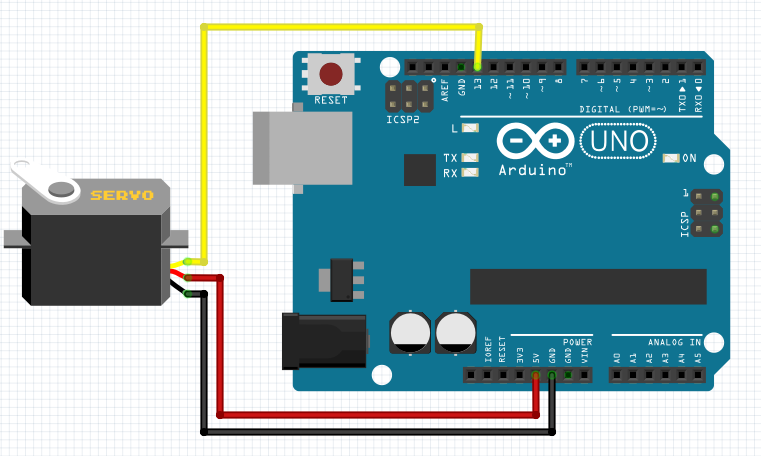

Servo Motor
-----------------

The connection diagram for servo motor is shown below:

+----------+--------------+
| Relay    | Arduino Uno  |
+==========+==============+
| VCC      | 5V           |
+----------+--------------+
| GND      | GND          |
+----------+--------------+
| Data     | D13          |
+----------+--------------+

Rotating Servo Motor
^^^^^^^^^^^^^^^^^^^^^^

.. code-block:: python

   import raspidevkit
   import time

   machine = raspidevkit.Machine()
   arduino = machine.attach_arduino('/dev/ttyUSB0')
   servo_motor = arduino.attach_servo_motor(13)
   servo_motor.rotate(90)
   time.sleep(1)
   servo_motor.rotate(180)
   time.sleep(1)
   servo_motor.rotate(0)
