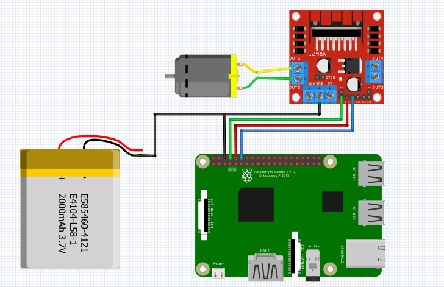

L298N Motor Driver
---------------------

L298N Motor Driver can control up to 2 DC motor and can spawn a `DC Motor` object 

Controlling a Motor
^^^^^^^^^^^^^^^^^^^^^

The connection diagram for L298N Motor Driver is shown below:

+----------+--------------+----------+---------+
| L298N    | Raspberry Pi | DC Motor | Battery |
+==========+==============+==========+=========+
| ENA      | GPIO14       |          |         |
+----------+--------------+----------+---------+
| IN1      | GPIO15       |          |         |
+----------+--------------+----------+---------+
| IN2      | GPIO18       |          |         |
+----------+--------------+----------+---------+
| Mot A    |              | Any      |         |
+----------+--------------+----------+---------+
| Mot A    |              | Any      |         |
+----------+--------------+----------+---------+
| VCC      |              |          | Bat+    |
+----------+--------------+----------+---------+
| GND      |              |          | Bat-    |
+----------+--------------+----------+---------+

You can use other external supply beside a battery

.. code-block:: python

   import raspidevkit

   machine = raspidevkit.Machine()
   pins = (12, 13, 14)
   l298n = machine.attach_l298n(pins)
   motor = l298n.attach_motor()
   motor.run()
   time.sleep(5)
   motor.stop()

Setting Motor Speed
^^^^^^^^^^^^^^^^^^^^^^

This is only possible if you've activated the pwm mode of the motor when spawning and then motor speed can be set by using the `set_speed` method passing in the speed you want.

.. code-block:: python

   import raspidevkit

   machine = raspidevkit.Machine()
   pins = (14, 15, 18)
   l298n = machine.attach_l298n(pins)
   motor = l298n.attach_motor(is_pwm=True)
   motor.run()
   motor.set_speed(75)
   time.sleep(5)
   motor.stop()

Calling the `set_speed` method when the motor's PWM mode is not enabled will throw an exception

Note: that the max is `100` and min is `0`

Dual Motor Setting
^^^^^^^^^^^^^^^^^^^^^^

Adding additional motor is easy and can be simply done by adding additional pins to be used.

Below is a sample diagram for dual motor:

+----------+--------------+----------+---------+
| L298N    | Raspberry Pi | DC Motor | Battery |
+==========+==============+==========+=========+
| ENA      | GPIO14       |          |         |
+----------+--------------+----------+---------+
| IN1      | GPIO15       |          |         |
+----------+--------------+----------+---------+
| IN2      | GPIO18       |          |         |
+----------+--------------+----------+---------+
| ENB      | GPIO25       |          |         |
+----------+--------------+----------+---------+
| IN3      | GPIO24       |          |         |
+----------+--------------+----------+---------+
| IN4      | GPIO23       |          |         |
+----------+--------------+----------+---------+
| Mot A    |              | Any      |         |
+----------+--------------+----------+---------+
| Mot A    |              | Any      |         |
+----------+--------------+----------+---------+
| Mot B    |              | Any      |         |
+----------+--------------+----------+---------+
| Mot B    |              | Any      |         |
+----------+--------------+----------+---------+
| VCC      |              |          | Bat+    |
+----------+--------------+----------+---------+
| GND      |              |          | Bat-    |
+----------+--------------+----------+---------+

.. code-block:: python

   import raspidevkit

   machine = raspidevkit.Machine()
   pins = pins = (14, 15, 18, 25, 24, 23)
   l298n = machine.attach_l298n(pins)
   motor1 = l298n.attach_motor(is_pwm=True)
   motor2 = l298n.attach_motor()
   motor1.run()
   motor1.set_speed(75)
   motor2.run()
   time.sleep(5)
   motor1.stop()
   motor2.stop()

**NOTE**: Adding additional motor when the pins used by the driver is only 3 (ENA, IN1, IN2) 
will throw an exception as this is only configured to support 1 motor.
To support two motors pass a tuple with 6 pins (ENA, IN1, IN2, ENB, IN3, IN4) 
