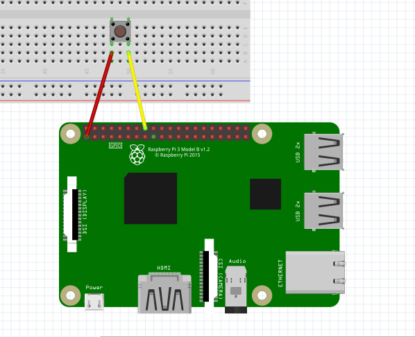

Button
-----------------

The connection diagram for button is shown below:

+----------+--------------+
| Button   | Raspberry Pi |
+==========+==============+
| VCC      | GPIO23       |
+----------+--------------+
| GND      | GND          |
+----------+--------------+

By default, the pin is pull down, so you won't need a resistor for this

Reading Button State
^^^^^^^^^^^^^^^^^^^^^^^

.. code-block:: python

   import raspidevkit

   machine = raspidevkit.Machine()
   button = machine.attach_led(23)
   pressed = button.read()
   print(pressed)
