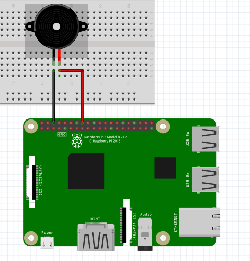

Buzzer
-----------------

There are two types of buzzer that `raspidevkit` support, the ``Active``` and the ``Passive``` type of buzzers

The connection diagram of the two buzzer is just the same as shown below:





+----------+--------------+
| Buzzer   | Raspberry Pi |
+==========+==============+
| VCC      | GPIO23       |
+----------+--------------+
| GND      | GND          |
+----------+--------------+

Active Buzzer
^^^^^^^^^^^^^^^^^

Active buzzers produces a constant sound frequency when voltage is given to its pins and can be controlled just like an LED by turning it on or turn_off

.. code-block:: python

   import raspidevkit
   import time

   machine = raspidevkit.Machine()
   buzzer = machine.attach_active_buzzer(23)
   buzzer.turn_on()
   time.sleep(3)
   buzzer.turn_off()

Passive Buzzer
^^^^^^^^^^^^^^^^^

Unlike active buzzers, a passive buzzer can change the sound it produces by depending on the frequency supplied. 

Playing a Note
##################

You can try simulating a note by using the soundutil helper package. It is also possible to add a duration on how many seconds you want to play the note

.. code-block:: python

   import raspidevkit
   from raspidevkit.machineutils import soundutil
   import time

   machine = raspidevkit.Machine()
   buzzer = machine.attach_passive_buzzer(23)
   C3 = soundutil.get_note_frequency('C3')
   buzzer.play_note(C3)
   # Play with duration included
   buzzer.play_note(C3, duration=3)


Playing Music
##################

You can also play music by creating a music sheet like list indicating the notes and beats each note is going to take.

.. code-block:: python

   import raspidevkit
   from raspidevkit.machineutils import soundutil
   import time

   machine = raspidevkit.Machine()
   buzzer = machine.attach_passive_buzzer(23)
   notes = ['C3', 'C3', 'E3', 'F3', 'A2']
   beats = [4, 4, 4, 8, 16]
   buzzer.play_note(soundutil.get_note_frequency('C3'))
