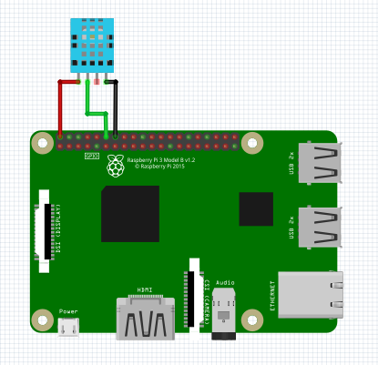

DHT Sensor
-----------------

DHT11 and DHT22 are both kinds of DHT Sensor, both behave the same, the difference is just that both have different specs such as operating conditions

The connection diagram for DHT sensor is shown below:

+------------+--------------+
| DHT Sensor | Raspberry Pi |
+============+==============+
| VCC        | 5V           |
+------------+--------------+
| GND        | GND          |
+------------+--------------+
| Data       | GPIO18       |
+------------+--------------+

Reading Temperature
^^^^^^^^^^^^^^^^^^^^^^^

.. code-block:: python

   import raspidevkit

   machine = raspidevkit.Machine()
   dht11 = machine.attach_dht11(18)
   temperature = dht11.get_temperature()
   print(temperature)

Reading Humidity
^^^^^^^^^^^^^^^^^^^^^^^

.. code-block:: python

   import raspidevkit

   machine = raspidevkit.Machine()
   dht11 = machine.attach_dht11(18)
   humidity = dht11.get_humidity()
   print(humidity)

Get All Parameters
^^^^^^^^^^^^^^^^^^^^^^^

It is inefficient to call each get parameter per read.
If you want to get both parameter in both reading use ``get_data()``

.. code-block:: python

   import raspidevkit

   machine = raspidevkit.Machine()
   dht11 = machine.attach_dht11(18)
   temperature, humidity = dht11.get_data()
   print(temperature)
   print(humidity)
