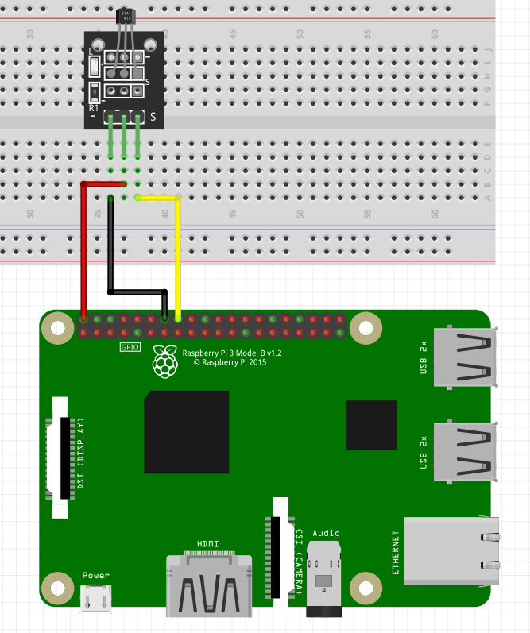

Hall Effect Sensor
-----------------

The connection diagram for hall effect is shown below:

+----------+--------------+
| Sensor   | Raspberry Pi |
+==========+==============+
| Signal   | GPIO23       |
+----------+--------------+
| VCC      | 5V           |
+----------+--------------+
| GND      | GND          |
+----------+--------------+

Depending on the model of the hall effect sensor, you might need to add capacitors
and resistors to make it make. In this sketch, the model used is KY-003.

Reading Sensor State
^^^^^^^^^^^^^^^^^^^^^^^

.. code-block:: python

   import raspidevkit

   machine = raspidevkit.Machine()
   attach_hall_effect_sensor = machine.attach_hall_effect_sensor(23)
   value = attach_hall_effect_sensor.read()
   print(value)
