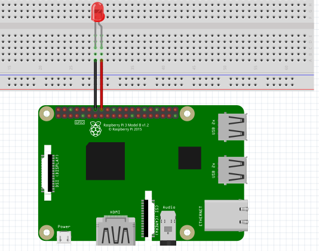

LED
-----------------

The connection diagram for LED is shown below:

+----------+--------------+
| LED      | Raspberry Pi |
+==========+==============+
| VCC      | GPIO23       |
+----------+--------------+
| GND      | GND          |
+----------+--------------+

By default, the pin is set to pull down so you won't need a resistor for this

Blinking LED
^^^^^^^^^^^^^^^^^

.. code-block:: python

   import raspidevkit
   import time

   machine = raspidevkit.Machine()
   led = machine.attach_led(23)
   led.turn_on()
   time.sleep(3)
   led.turn_off()
