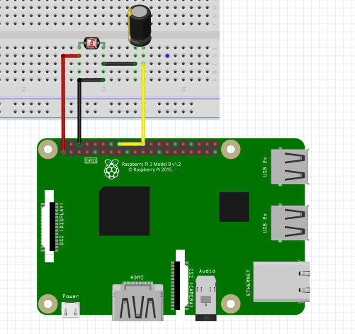

Light Sensor
-----------------

The connection diagram for button is shown below:

In this connection, you will need need a 50uF capacitor.

+----------+--------------+-----------+
| LDR      | Raspberry Pi | Capacitor |
+==========+==============+===========+
| VCC      | 3.3V         |           |
+----------+--------------+-----------+
| GND      | GND          | GND       |
+----------+--------------+-----------+
|          | GPIO23       | VCC       |
+----------+--------------+-----------+

Reading Light Value
^^^^^^^^^^^^^^^^^^^^^^^

.. code-block:: python

   import raspidevkit

   machine = raspidevkit.Machine()
   light_sensor = machine.attach_light_sensor(23)
   value = light_sensor.read()
   print(value)
