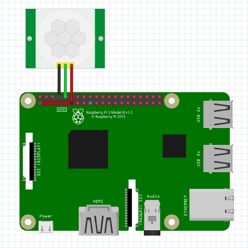

PIR Motion Sensor
-------------------

The connection diagram for PIR Motion Sensor (HC-SR501) is shown below:

+----------+--------------+
| HC-SR501 | Raspberry Pi |
+==========+==============+
| VCC      | 3.3V         |
+----------+--------------+
| GND      | GND          |
+----------+--------------+
| Data     | GPIO15       |
+----------+--------------+

Reading PIR Motion State
^^^^^^^^^^^^^^^^^^^^^^^^^^^

.. code-block:: python

   import raspidevkit

   machine = raspidevkit.Machine()
   pir = machine.attach_pir_motion_sensor(15)
   value = pir.read()
   print(value)
