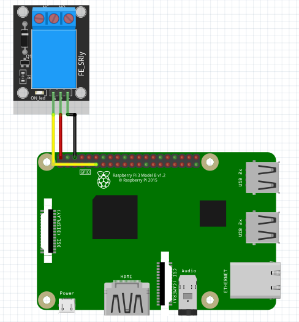

Relay
-----------------

The connection diagram for relay is shown below:

+----------+--------------+
| Relay    | Raspberry Pi |
+==========+==============+
| VCC      | 5V           |
+----------+--------------+
| GND      | GND          |
+----------+--------------+
| Data     | GPIO15       |
+----------+--------------+

Setting Relay State
^^^^^^^^^^^^^^^^^^^^^^

.. code-block:: python

   import raspidevkit
   import time

   machine = raspidevkit.Machine()
   relay = machine.attach_relay(15)
   relay.turn_on()
   time.sleep(3)
   relay.turn_off()
