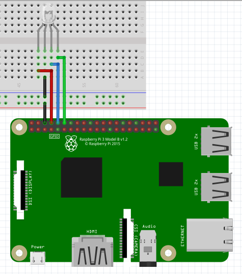

RGB LED
-----------------

The connection diagram for RGB LED is shown below:

+----------+--------------+
| RGB LED  | Raspberry Pi |
+==========+==============+
| GND      | GND          |
+----------+--------------+
| Red      | GPIO14       |
+----------+--------------+
| Blue     | GPIO15       |
+----------+--------------+
| Green    | GPIO18       |
+----------+--------------+

Setting LED Color
^^^^^^^^^^^^^^^^^

.. code-block:: python

   import raspidevkit
   import time

   machine = raspidevkit.Machine()
   rgb_led = machine.attach_rgb_led((14, 15, 18))
   rgb_led.set_color(raspidevkit.RED)
   time.sleep(1)
   rgb_led.set_color(raspidevkit.GREEN)
   time.sleep(1)
   rgb_led.set_color(raspidevkit.BLUE)
   time.sleep(1)
   rgb_led.set_color(raspidevkit.YELLOW)
   time.sleep(1)
   rgb_led.set_color(raspidevkit.MAGENTA)
   time.sleep(1)
   rgb_led.set_color(raspidevkit.CYAN)
   time.sleep(1)
   rgb_led.set_color(raspidevkit.WHITE)
   time.sleep(1)
   rgb_led.turn_off()
