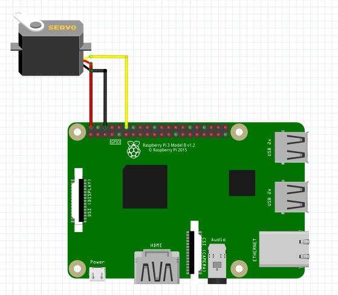

Servo Motor
-----------------

The connection diagram for servo motor is shown below:

+----------+--------------+
| Relay    | Raspberry Pi |
+==========+==============+
| VCC      | 5V           |
+----------+--------------+
| GND      | GND          |
+----------+--------------+
| Data     | GPIO18       |
+----------+--------------+

Rotating Servo Motor
^^^^^^^^^^^^^^^^^^^^^^

.. code-block:: python

   import raspidevkit
   import time

   machine = raspidevkit.Machine()
   servo_motor = machine.attach_servo_motor(18)
   servo_motor.rotate(90)
   time.sleep(1)
   servo_motor.rotate(180)
   time.sleep(1)
   servo_motor.rotate(0)

You may need to update the servo motor min-max angle duty cycle depending on the servo motor model.
By default the servo min-max is set to `[(-180, 2.5), (180, 12.5)]`. If the servo motor model does not
support rotating backwards to negative angles or supports a full rotation mode, you may set the
min-max angle duty cycle mapping to `[(0, 2.5), (180, 12.5)]` or `[(0, 2.5), (360, 12.5)]`, respectively.

.. code-block:: python

   import raspidevkit
   import time

   machine = raspidevkit.Machine()
   servo_motor = machine.attach_servo_motor(18)
   servo_motor.set_angle_duty_cycle(((0, 2.5), (180, 12.5)))
   servo_motor.rotate(90)
   time.sleep(1)
   servo_motor.rotate(180)
   time.sleep(1)
   servo_motor.rotate(0)
